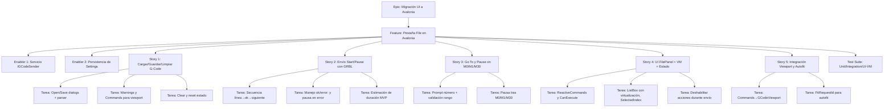
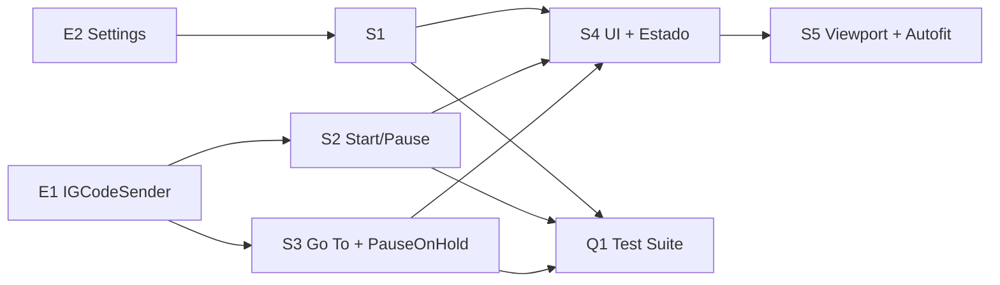

# Plan de Proyecto — Pestaña “File” (Avalonia)

Referencia principal: `plan/feature-file-tab-implementation-1.md`

Este documento sigue el prompt “GitHub Issue Planning & Project Automation” para convertir los requisitos de la pestaña “File” en un plan ejecutable con jerarquía Epic → Feature → Stories/Enablers → Tasks/Tests, dependencias, prioridades y estimaciones.

---

## 1) Project Overview

- Feature Summary: Migración y finalización de la pestaña “File” a Avalonia (MVVM + ReactiveUI), incluyendo apertura/guardado/limpieza de G‑Code, listado y selección de líneas, envío secuencial a GRBL con pausa, “Go to line”, estado (`FilePosition/FileLength`) y tiempos (`Runtime/EstimatedDuration`), “Pause on M0/M1/M30”, e integración con `GCodeViewport`.
- Business Value: Habilita el flujo principal de trabajo del usuario (cargar archivo, visualizar, enviar al CNC de forma segura, pausar y reanudar), imprescindible para una versión funcional cross‑platform.
- Success Criteria (KPIs):
  - Compila en .NET 8 (Windows/Linux) y la UI carga la pestaña “File”.
  - Puede abrir/guardar/limpiar G‑Code; lista y selecciona la línea actual.
  - Envío secuencial con `ok`/`error:` y pausa en `M0/M1/M30` (opcional).
  - Muestra `FilePosition/FileLength` y `Runtime/EstimatedDuration`.
  - Se deshabilitan acciones incompatibles durante envío.
  - Tests unitarios del sender y del VM cubren escenarios clave.
- Key Milestones:
  1. Enabler: `IGCodeSender` (interfaz) creada y registrada en DI; implementación inicial `GCodeSender` lista. Siguiente: tests (MVP una línea en vuelo).
  2. `FileViewModel` + comandos y bindings básicos.
  3. `FilePanel.axaml` con controles, bindings y virtualización de lista.
  4. Integración con `MainWindowViewModel` y `GCodeViewport` (autofit).
  5. Persistencia de settings (`LastGCodeDirectory`, `PauseFileOnHold`).
  6. Manejo de errores/UX, estados y deshabilitación condicional.
  7. Suite de tests y documentación actualizada.
- Risk Assessment:
  - I/O serial en Linux (permisos/grupo `dialout`) — Mitigar con documentación/scripts (ya previstos en repo).
  - Parser/estimador duración: MVP con heurística simple; refinar en siguiente iteración.
  - Rendimiento lista de líneas: usar virtualización en `ListBox` y colecciones observables.
  - Diferencias WPF→Avalonia (bindings, comandos, propiedades estiladas) — Mitigar con guías de migración.

---

## 2) Work Item Hierarchy

---

## 3) GitHub Issues Breakdown (plantillas cumplimentadas)

### Epic

Título sugerido: Epic: Migración UI a Avalonia — Pestaña “File”

- Epic Description: Entregar la pestaña “File” funcional en Avalonia, base para flujo de trabajo CNC.
- Business Value: Núcleo de la aplicación para operar con archivos y control de máquina.
- Epic Acceptance Criteria:
  - [x] Feature “Pestaña File en Avalonia” entregada con criterios de aceptación cumplidos.
  - [x] Tests relevantes implementados y verdes en CI.
  - [x] Documentación de migración y contrato de `IGCodeSender` actualizada.
- Definition of Done:
  - [x] Compila y pasa tests en matriz (Ubuntu, Windows).
  - [ ] Cobertura mínima establecida en Core y sender (>70% en Core).
        Nota: integrar/reportar cobertura en CI está pendiente.
  - [x] Docs actualizadas.

### Feature

Título sugerido: Feature: Pestaña “File” (Avalonia)

- Feature Acceptance Criteria (trazados desde Requirements del plan):
  - [x] Open: diálogo, leer/parsear, warnings, `Commands` y `GCodeLines`, `CurrentFileName` y `LastGCodeDirectory`.
  - [x] Save: diálogo y guardado en disco (MVP con líneas cargadas).
  - [x] Clear: limpia archivo/lista/estado, refresca viewport, `HeightMapApplied=false`.
  - [x] Start: envío secuencial con avance `FilePosition` y actualización `Runtime`.
  - [x] Pause: pausa manteniendo posición.
  - [x] Go To: solicitar número, validar y reposicionar si no se envía.
  - [x] Pause on Hold: pausa tras `M0/M1/M30` cuando habilitado.
  - [x] Respuestas GRBL: `ok` avanza, `error:` pausa y notifica (MVP).
  - [x] Deshabilitar `Open/Save/Clear/Goto` durante envío.
  - [x] Mostrar `FilePosition/FileLength` y `Runtime/EstimatedDuration` y seleccionar línea actual.
  - [x] Envío encapsulado en `IGCodeSender` con estados observables.
  - [x] Settings: recordar `LastGCodeDirectory` y `PauseFileOnHold` (cross‑platform).
- Definition of Done:
  - [ ] Historias y enablers completados, tests verdes, UX validada.

### Enabler 1: IGCodeSender

- Requisitos Técnicos:
  - [x] Interfaz (`State`, `FilePosition`, `FileLength`, `Runtime`, `EstimatedDuration`, `PauseOnHold`, `IsSending`, `CurrentLineText`).
  - [x] Métodos (`Load`, `Start`, `Pause`, `Clear`, `Goto`, `Dispose`).
  - [x] Eventos/Observables (`StateChanged`, `PositionChanged`, `ErrorOccurred`).
  - [x] Protocolo envío: una línea en vuelo; usa `ISerialPortService.WriteLine` y consume `DataReceived` (`ok`/`error:`).
  - [x] `PauseOnHold` en `M0/M1/M30` al finalizar línea (tras `ok`).
  - [x] Validaciones: `Goto` prohibido en `Sending`; rango; `Start` sin líneas o sin puerto abierto.
  - [x] Estimación duración MVP.
- Tareas:
  - [x] Definir interfaz en `src/OpenCNCPilot.Hardware/Services/`.
  - [x] Implementación concreta con suscripción al puerto.
  - [x] Tests unitarios (comportamientos y errores) básicos en `OpenCNCPilot.Integration.Tests`.

### Enabler 2: Persistencia de Settings

- Requisitos Técnicos:
  - [x] Añadir `LastGCodeDirectory: string`, `PauseFileOnHold: bool` en `Settings.settings` (MVP).
  - [x] `JsonSettingsService` guarda/carga ambos campos (rama Avalonia).
- Tareas:
  - [x] Actualizar modelo y servicio.
  - [x] Tests de persistencia.

### Story 1: Cargar/Guardar/Limpiar G‑Code

- Acceptance Criteria:
  - [x] `OpenCommand` abre, lee, parsea, muestra warnings, setea `Commands` y `GCodeLines`, actualiza settings y `FitRequestId`.
  - [x] `SaveCommand` guarda líneas en ruta elegida.
  - [x] `ClearCommand` limpia estado y viewport; `sender.Clear()`.
- Tareas:
  - [x] Integrar `IDialogService` (open/save) y `IGCodeParser`.
  - [x] Mapear warnings a UI (alerta) desde `OpenCommand` (ya no depende de `MainWindowViewModel`).
  - [x] Refrescar viewport y banderas (autofit tras abrir/limpiar).

### Story 2: Envío Start/Pause con GRBL

- Acceptance Criteria:
  - [x] `StartCommand` inicia envío secuencial y actualiza `Runtime`.
  - [x] `PauseCommand` pausa manteniendo posición.
  - [x] Manejo `ok`/`error:` acorde a MVP.
- Tareas:
  - [x] Comandos y binding con `IGCodeSender`.
  - [x] Actualización de estado y tiempos.

### Story 3: Go To y Pause on M0/M1/M30

- Acceptance Criteria:
  - [x] `GotoCommand` pide número, valida rango, y ejecuta `sender.Goto` si permitido.
  - [x] `PauseOnHold` detiene tras línea con `M0/M1/M30`.
- Tareas:
  - [x] `PromptNumberAsync` y validación.
  - [x] Detección M‑codes en sender.

### Story 4: UI FilePanel + VM + Estado

- Acceptance Criteria:
  - [x] Botones y `CheckBox` con `IsEnabled` según estado (via `ReactiveCommand` y `CanExecute`).
  - [ ] `ListBox` con virtualización, `SelectedIndex` sigue `FilePosition` (virtualización pendiente; `SelectedIndex` implementado).
  - [x] Mostrar `FilePosition/FileLength`, `Runtime/EstimatedDuration`.
- Tareas:
  - [x] `FilePanel.axaml` + `.axaml.cs` mínimo.
  - [x] `FileViewModel` y bindings.

### Story 5: Integración Viewport y Autofit

- Acceptance Criteria:
  - [x] `GCodeViewport.Commands` enlazado a `FileViewModel.Commands`.
  - [x] `FitRequestId` dispara autofit tras abrir/limpiar.
- Tareas:
  - [x] Wiring en `MainWindow`/contenedor.
  - [x] Actualizar al cargar/limpiar.

### Test Suite (Q1)

- Unit (xUnit + FluentAssertions): sender y VM.
- Integration (sin hardware): fake serial que devuelve `ok` con retardo.
- UI/VM: CanExecute y SelectedIndex.
- Performance: parser 10k líneas < 1s (dataset sintético si falta).

---

## 4) Prioridad, Valor y Estimaciones

- Prioridad/Valor:
  - Feature completo: `priority-high`, `value-high` (bloquea release usable).
  - E1 IGCodeSender: `priority-high` (bloquea Stories 2–5).
  - S1 y S4: `priority-high` (flujo base y UI).
  - S2 y S3: `priority-high` (operación con GRBL).
  - S5: `priority-medium` (mejora UX/viewport pero necesaria para fluidez).
- Estimaciones (Fibonacci):
  - E1 IGCodeSender: 5 pts
  - E2 Settings: 2 pts
  - S1 Cargar/Guardar/Limpiar: 3 pts
  - S2 Start/Pause + GRBL: 3 pts
  - S3 Go To + PauseOnHold: 3 pts
  - S4 UI + Estado: 3 pts
  - S5 Viewport + Autofit: 2 pts
  - Q1 Test Suite adicional: 3 pts
  - Total estimado: 24 pts (1–2 sprints según capacidad).

---

## 5) Dependency Management

Tipos:
- Blocks: E1→S2/S3; E2→S1; S1/S2/S3→S4; S4→S5.
- Related: S1↔S5 (viewport), S2↔S3 (controles de ejecución).
- Prerequisite: Configuración de permisos serial en Linux documentada.
- Parallel: E2 y maquetación base de S4 pueden iniciar en paralelo.

---

## 6) Tareas Detalladas y Checklist de Ejecución

- Enabler 1 — IGCodeSender
  - [x] Definir interfaz en `src/OpenCNCPilot.Hardware/Services/IGCodeSender.cs`.
  - [x] Implementación `GCodeSender` suscrita a `ISerialPortService.DataReceived`.
  - [x] Detección M‑codes (`M0|M1|M30`) y pausa condicional.
  - [x] Estimador de duración MVP (por línea o heurística simple).
  - [x] Eventos observables y thread-safety para VM.
  - [x] Tests unitarios/integración de estados, errores y `PauseOnHold`.
- Enabler 2 — Settings
  - [x] Ampliar `AppSettings` con `LastGCodeDirectory`, `PauseFileOnHold`.
  - [x] Persistencia en `JsonSettingsService`.
  - [x] Tests de persistencia.
  - [x] MVP: Añadidos `LastGCodeDirectory` y `PauseFileOnHold` a `OpenCNCPilot/Properties/Settings.settings` (legado) para compat.
- Story 1 — Cargar/Guardar/Limpiar
  - [x] `OpenCommand`: diálogo, lectura, parseo, warnings.
  - [x] Poblar `Commands` para viewport y `GCodeLines`.
  - [x] Actualizar `CurrentFileName` y `LastGCodeDirectory`.
  - [x] `SaveCommand`: escribir archivo (MVP).
  - [x] `ClearCommand`: reset estado + `sender.Clear()` + `FitRequestId++`.
- Story 2 — Start/Pause con GRBL
  - [x] `StartCommand` y `PauseCommand` con `CanExecute` según `IsSending`.
  - [x] Avance por `ok` y pausa en `error:` (alerta y estado `Paused`).
- Story 3 — Go To y Pause on Hold
  - [x] `GotoCommand`: `PromptNumberAsync`, validación y `sender.Goto` en `Idle/Paused`.
  - [x] `PauseOnHold`: `CheckBox` mapea a `sender.PauseOnHold` + persistencia.
- Story 4 — UI + Estado
  - [x] `FilePanel.axaml` con botones, checkbox, indicadores.
  - [x] `SelectedIndex` ← `FilePosition`; mostrar tiempos y longitudes.
  - [x] Deshabilitar `Open/Save/Clear/Goto` durante envío.
  - Nota: `ListBox` en Avalonia 11 virtualiza por defecto mediante su panel; evitamos propiedades WPF (`IsVirtualizing`, `VirtualizationMode`). Si se detecta lag con archivos muy grandes, evaluar `ItemsRepeater` + `VirtualizingScrollHost`.
- Story 5 — Viewport + Autofit
  - [x] Bind `Commands` a `GCodeViewport`.
  - [x] `FitRequestId` tras `Open`/`Clear`.
- Integración y DI
  - [x] Registrar `IGCodeSender` en `App.axaml.cs`.
  - [x] Registrar `FileViewModel`.
  - [x] Exponer `File` en `MainWindowViewModel`.
  - [x] Eliminar duplicación previa de carga/limpieza (delegación a `FileViewModel`).

Nota de progreso (2025-08-29):
- Creada `IGCodeSender` y primera implementación `GCodeSender` con envío una‑línea‑en‑vuelo, manejo `ok/error:`, pausa opcional por `M0/M1/M30`, estimación de duración MVP y eventos. Registrado en DI.
- Tests agregados para `GCodeSender`: Start→ok→fin, Pause, PauseOnHold, error:, Goto. Resultado: todos verdes.
- Implementados `FileViewModel` (Open/Save/Clear/Start/Pause/Goto, `PauseOnHold` persistente) y `FilePanel.axaml` (bindings a comandos, indicadores de estado, `ListBox` con `ItemsSource` y `SelectedIndex`).
- Integrado `FilePanel` en `MainWindow.axaml`; `MainWindowViewModel` ahora expone `FileTab` (se añadió sobrecarga retro‑compatible del constructor y un `NoopSender` para no romper tests).
- `AppSettings` ampliado con `PauseFileOnHold` y persistencia en `JsonSettingsService`; `FileViewModel` carga/guarda la preferencia.
- DI actualizado para registrar `FileViewModel` y `IGCodeSender`.
- Integración del viewport completada: `MainWindowViewModel` suscribe `FileTab.ParsedCommands` y actualiza `GCodeCommands` con `FitRequestId++` en abrir/limpiar. Se eliminaron duplicaciones delegando `Open/Clear` a `FileViewModel` y los warnings se muestran desde `OpenCommand`.
- Build local: PASS con warnings menores; UI.Tests compilan.
- Pendientes inmediatos: virtualización de la `ListBox` (S4 T4B), tests de persistencia de settings (E2), y pequeños ajustes de UX (deshabilitaciones adicionales si aplica).

Validación adicional (2025-08-29):
- Corregido ReactiveUI en `MainWindowViewModel`: `this.WhenAnyValue(x => x.FileTab.ParsedCommands)` evita la excepción "Unsupported expression of type 'Constant'" en tests.
- Añadidos tests de persistencia de settings (`PauseFileOnHold` y round‑trip de directorio) y un test UI/VM para deshabilitación de comandos durante envío. Suite de tests: PASS (Core 16/16, Integration 6/6, UI 38/38).

Siguientes pasos inmediatos:
- [ ] Implementar virtualización óptima para listas grandes: evaluar `ItemsRepeater` + `VirtualizingScrollHost` si se detectan problemas de rendimiento; `ListBox` en Avalonia 11 ya virtualiza con su panel por defecto.
- [ ] Revisar deshabilitación de acciones durante envío para casos borde adicionales a `CanExecute`.

Troubleshooting (build XAML):
- Si reaparecen errores de propiedades no soportadas (p. ej., `IsVirtualizing`, `VirtualizationMode`, o uso de `Items` en lugar de `ItemsSource`), limpiar artefactos y recompilar:
  - `rm -rf src/OpenCNCPilot.UI/bin src/OpenCNCPilot.UI/obj`
  - `dotnet build OpenCNCPilot.Modern.sln`

Documentación
  - [x] Actualizar `docs/migration_guide.md` (pestaña “File”).
  - [x] Documentar contrato/estados de `IGCodeSender`.

---

## 7) Testing Plan Resumido (derivado del plan)

- Unit (sender):
  - [ ] Start→ok avanza `FilePosition`; Idle al finalizar.
  - [ ] Pause detiene consumo de líneas.
  - [ ] `PauseOnHold=true` pausa tras línea con `M0/M1/M30`.
  - [ ] `Goto` en `Idle/Paused` OK; en `Sending` falla.
  - [ ] En `error:` → `Paused` + `ErrorOccurred`.
- Unit (FileViewModel):
  - [ ] `OpenCommand` actualiza settings, parser y colecciones.
  - [ ] `SaveCommand` escribe archivo; cancelación no altera estado.
  - [ ] `ClearCommand` limpia y llama `sender.Clear()`.
  - [ ] `GotoCommand` valida y llama `sender.Goto`.
- Integration (sin hardware):
  - [ ] `Open → Start → ok... → PauseOnHold → Pause`.
- UI/VM:
  - [ ] `CanExecute` según `IsSending`.
  - [ ] `SelectedIndex` sigue `FilePosition`.
- Performance:
  - [ ] Parser 10k líneas < 1s en Linux.

---

## 8) Definition of Done y Quality Gates

- Build: `dotnet build -c Release` sin errores en matriz OS.
- Lint/Format: `dotnet format` limpio; estilos por `.editorconfig`.
- Tests: 100% de pruebas del scope pasan; cobertura Core ≥ 70% (objetivo).
- Smoke test: abrir archivo grande, enviar primeras líneas y pausar sin crash.
- Docs: guía de migración y contrato `IGCodeSender` actualizados.
- Seguridad/Runtime: no usar APIs Windows‑only en Core/Hardware; serial Linux documentado.

---

## 9) Sugerencia de Sprint Plan (ejemplo)

- Sprint N (Objetivo): Entregar MVP operativo de la pestaña “File”.
- Historias comprometidas:
  - E1 (5), E2 (2), S1 (3), S2 (3), S4 (3) → 16 pts.
- Criterios de éxito: abrir/enviar/pausar/visualizar; tests verdes.
- Siguiente Sprint: S3 (3), S5 (2), Q1 extra (3) y refino de estimador.

---

## 10) Campos/Labels sugeridos para Issues

- Labels: `epic`, `feature`, `user-story`, `enabler`, `test`, `priority-high`, `value-high`, `component-ui`, `component-hardware`, `component-core`.
- Component: `Frontend` (UI/VM), `Backend` (Hardware sender), `Testing`.
- Estimate: puntos de historia asignados arriba.

---

## 11) Notas de Automatización (opcional)

- Se recomienda un workflow manual para crear issues desde este plan usando `actions/github-script`, enlazando dependencias y aplicando labels y estimaciones. No incluido aquí por simplicidad del repositorio.

---

Fin del documento.
